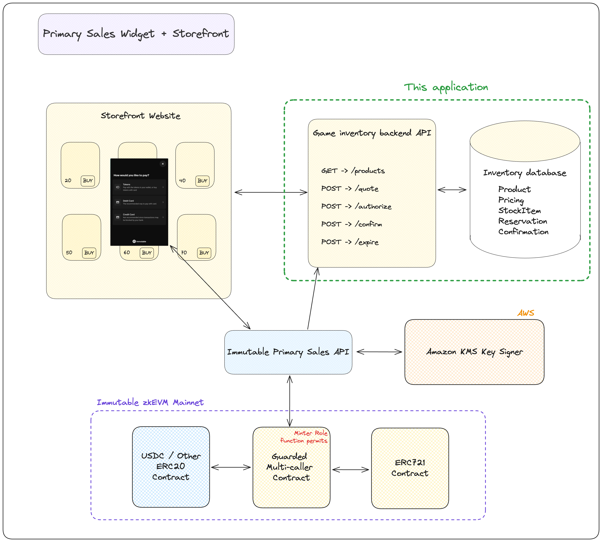

# Primary Sales Inventory Backend for conducting a sale using the Immutable Primary Sales Widget

This project is a backend API for running a primary sale using the Immutable Primary Sales widget. It is one part of the system that serves stock management or inventory endpoints for selling your ERC721s or ERC1155 items.



## Disclaimer

The sample code provided is for reference purposes only and is not officially supported by Immutable. It has undergone best effort testing by Immutable to ensure basic functionality. However, it is essential that you thoroughly test this sample code within your own environment to confirm its functionality and reliability before deploying it in a production setting. Immutable disclaims any liability for any issues that arise due to the use of this sample code. By using this sample code, you agree to perform due diligence in testing and verifying its suitability for your applications.

## Features

- Fastify web application + SQL database
- Products endpoint - fetch all products that are on sale and their prices in crypto and fiat
- Quote endpoint - fetch quote for specific stock items and quantities, sum totals
- Authorize endpoint - fetch available stock items and mark as reserved for purchasing
- Confirm endpoint - create a confirmation record of the sale
- Expire endpoint - expire the order and make stokc available again for purchase


## Setup Instructions

1. Install the dependencies:
   ```
   npm i
   ```
2. Copy the example environment file and fill it with your API key, and DB path(should be `file:./stockManagement.db`):
   ```
   cp .env.example .env
   ```
3. Fill in all of the environment variables for your appliction:

| Variable  | Description |
|-----------|------------|
| ENVIRONMENT| SANDBOX or PRODUCTION, the configuration you want to run with.|
| DATABASE_URL| Your database url to connect the db. default is `file:./stockManagement.db` (using sqlite3)|
|INEVTORY_API_KEY| API key for this application. Must also be added to the Priamry Sales widget config so the Primary sales API can call this application. |
|RESERVATION_TIME_MS| The stock reservation time in ms before orders should be expired. |

4. Run the DB migrations:
   ```
   npx prisma migrate dev
   ```
5. Load your database, https://sqlitebrowser.org/ is great for this. You can also write a script that uses the Prisma client to load the database.

**Product**

|id|name|description|rarity|contract_address|metadata_id|
|--|----|-----------|------|----------------|-----------|
|1| Product 1 |	description of product 1 |	rarity of product 1 | 0x123456789 | Token metadata id (uuid) |


**StockItem**

|product_id|token_id|available|
|----------|--------|---------|
| 1 |	1001 | 1 |

**Pricing**
|product_id|currency|currnecy_type|amount|currency_address|
|----------|--------|-------------|------|----------------|
|1|	USDC |	crypto|	1.0 |	0x3b2d8a1931736fc321c24864bceee981b11c3c57|
|1|	ETH |	crypto |	0.00033 |	0xe9e96d1aad82562b7588f03f49ad34186f996478|
|1|	USD |	fiat |	1.0 |	NULL|

7. Run the development server:

   ```
   npm start
   ```

## To-Do List

- [ ] Allow configuration for ERC1155s
- [ ] Consider switching to Pino instead of Winston for logging
- [ ] Troubleshoot why all console.log are not showing up in the console with logger.info
- [ ] Add color coding to success or failure in the logs
- [ ] Generally type more things

## Tech Stack

- Fastify
- Prisma ORM
- sqlite3
